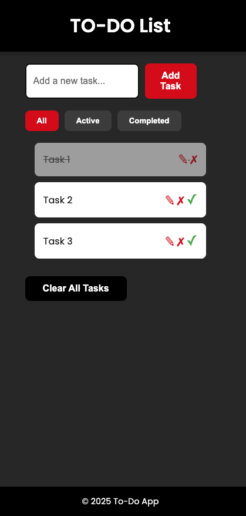
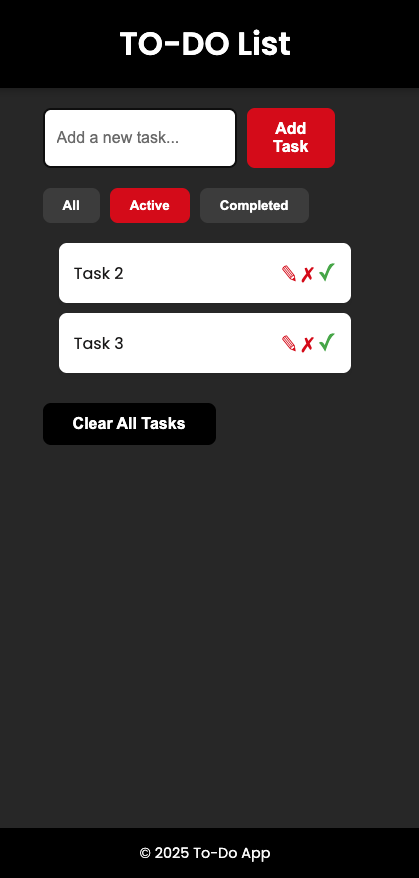
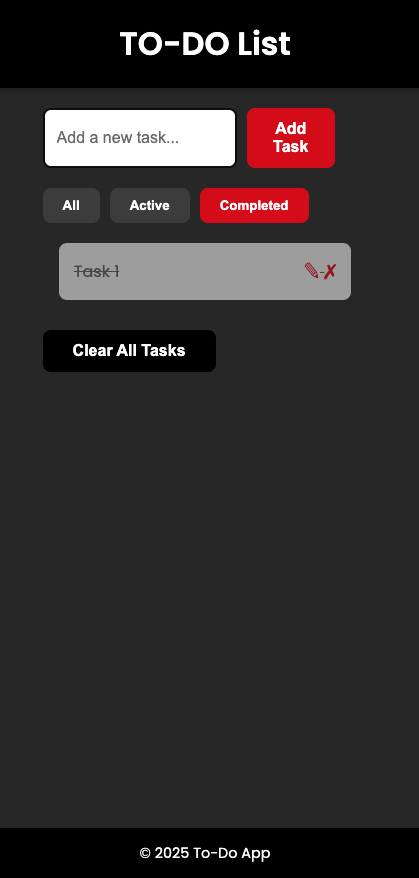

# 📝 To-Do List Application 

This project is a modern, lightweight, and user-friendly **To-Do List App** built using HTML, CSS, and vanilla JavaScript. Users can add, edit, delete, and mark tasks as completed, with full filtering functionality and local storage support.

---

## 🚀 Features

- ✅ Add tasks
- ✏️ Edit tasks
- ❌ Delete tasks
- ✔️ Mark tasks as completed
- 🔍 Filter by status (All / Active / Completed)
- 💾 Save tasks in browser using Local Storage
- ⚡ Add tasks with the Enter key
- 🎨 Dark-themed, responsive UI with stylish interactions

## 📁 File Structure
To-do-List/ ├── index.html ├── style.css ├── script.js├── ToDoListPosition1.png ├── ToDoListPosition2.png └── ToDoListPosition3.png


## ⚙️ Getting Started

1. Clone the repository:
   ```bash
   git clone https://github.com/your-username/your-todo-project.git

2. Navigate to project folder
   ```bash
    cd your-todo-project

3.Open index.html in your preferred browser.
    No installation or build tools required. 
    It's 100% frontend and runs directly in the browser.

## 📸 Screenshots

Here are some screenshots of the To-Do List app in different states:

|  |  |  |
|--------------------------------------|--------------------------------------|--------------------------------------|


